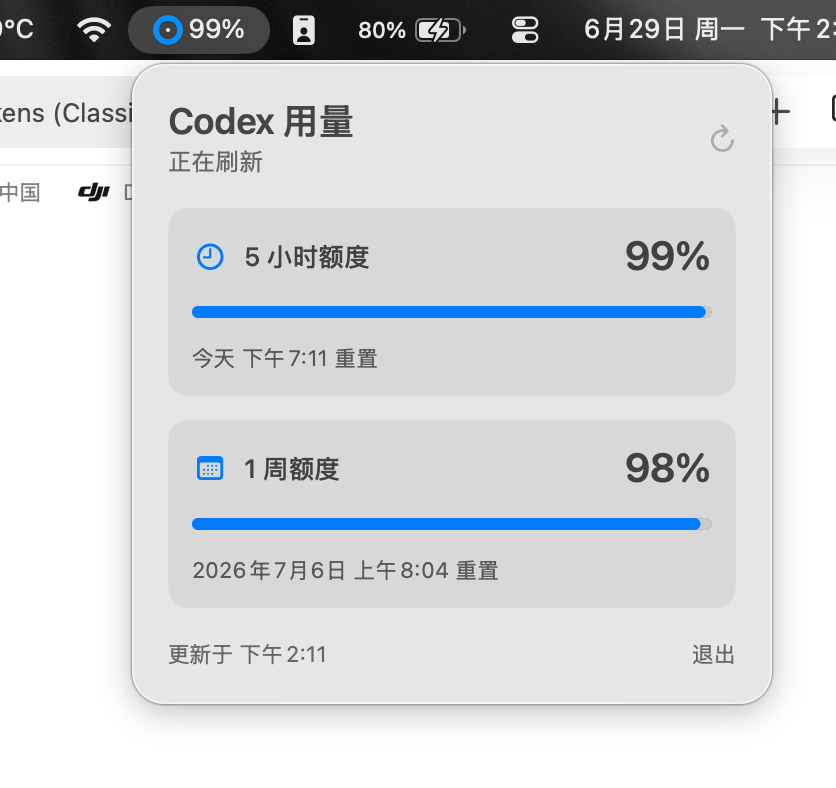

# Codex Limits Menu Bar

An unofficial native macOS menu bar utility that shows your remaining Codex usage limits.

It displays:

- Remaining 5-hour Codex usage.
- Remaining 1-week Codex usage.
- Dynamic menu bar ring based on the 5-hour remaining percentage.
- Reset dates and times.
- Manual refresh and automatic refresh.

## Screenshot



## Requirements

- macOS 14 or later.
- Apple Silicon Mac.
- Codex installed at one of these paths:
  - `/Applications/Codex.app/Contents/Resources/codex`
  - `/opt/homebrew/bin/codex`
  - `/usr/local/bin/codex`
  - `/usr/bin/codex`
- You must already be signed in to Codex locally.

## Build

```bash
./build-menubar.sh
```

The app will be created at:

```text
build/Codex Limits Menu Bar.app
```

Open it with:

```bash
open "build/Codex Limits Menu Bar.app"
```

## Start at Login

After building the app, install the login item:

```bash
./install-login-item.sh
```

This creates a LaunchAgent at:

```text
~/Library/LaunchAgents/app.codexlimits.menubar.plist
```

## How It Works

The app starts the local Codex app server with:

```bash
codex app-server --listen stdio://
```

It then calls the local `account/rateLimits/read` method and reads the Codex rate-limit response.

The app refreshes automatically every 3 minutes. Opening the popover or clicking the refresh button triggers an immediate refresh.

## Privacy

The app reads usage data from your local Codex installation. It does not send your usage data to any third-party server.

The local cache is written to:

```text
~/Library/Application Support/CodexLimitsMenuBar/rate-limits.json
```

Do not publish your local cache files.

## Notes

This is an unofficial tool. It depends on Codex local app-server behavior, which may change in future Codex releases.

## License

MIT. See [LICENSE](LICENSE) and [NOTICE](NOTICE).
